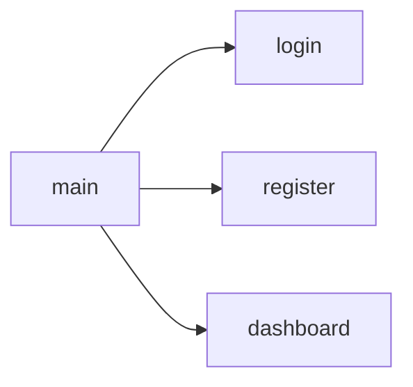

This is the plan. I will make three new files: register.ts, login.ts, and dashboard.ts.

The index.ts file will gather exports from all three. I believe the proper word for this is routing.

## Todo:
- [ ] Sample refactoring
- [ ] Refactor register
- [ ] Create login
- [ ] Create dashboard