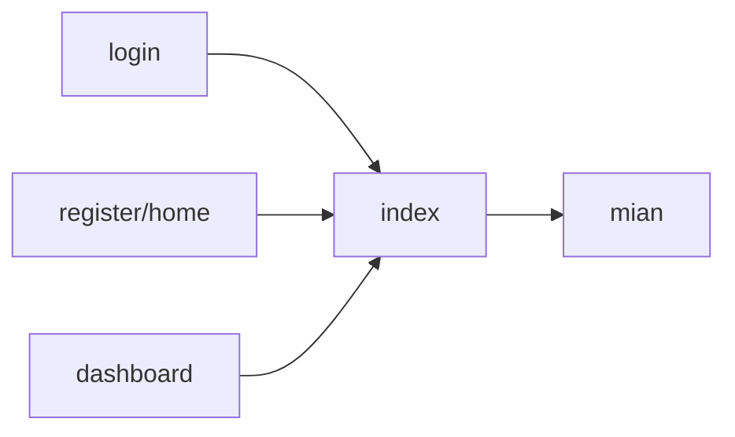

This is the plan. I will make three new files: register.ts, login.ts, and dashboard.ts.

The index.ts file will gather exports from all three. I believe the proper word for this is routing.

## Todo:
- [x] Sample refactoring
- [x] Refactor register
- [x] Rewrite register to export only one output
- [x] Create login
- [ ] Make password storage
- [ ] Make working login
- [ ] Create dashboard
- [ ] Make editable password storage